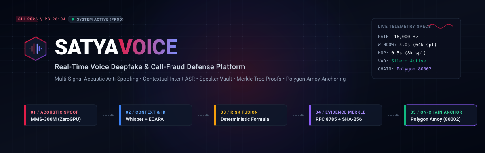
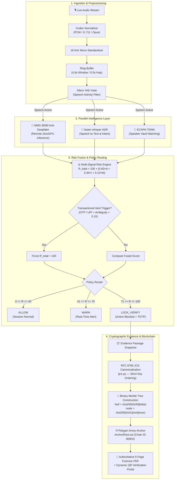
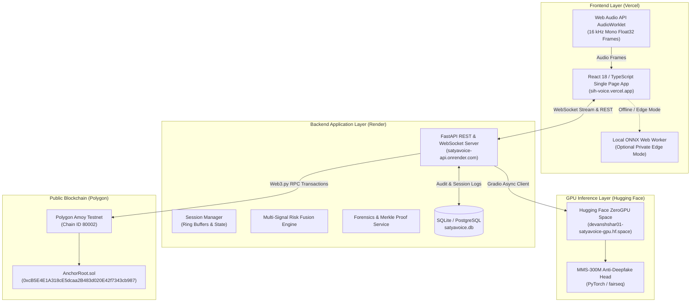
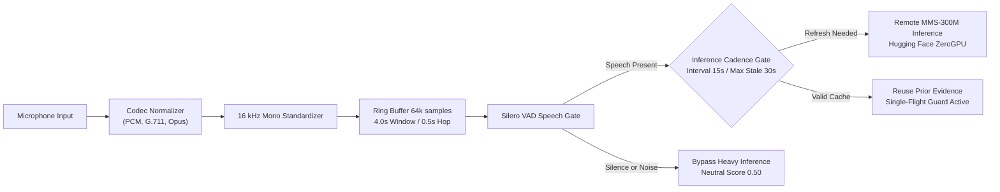
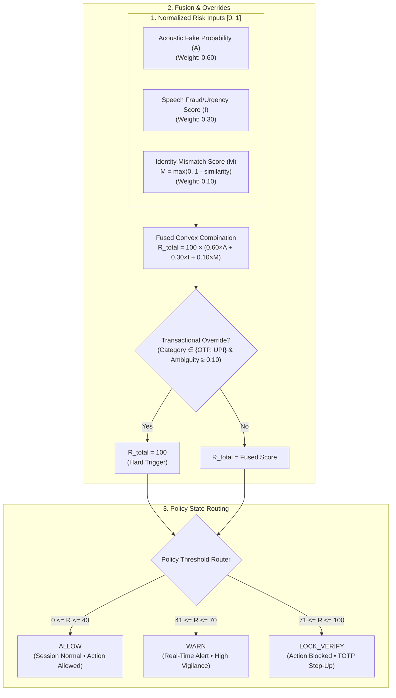
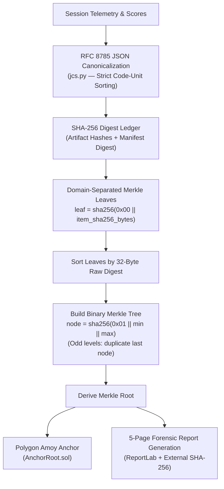
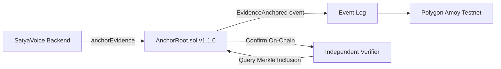
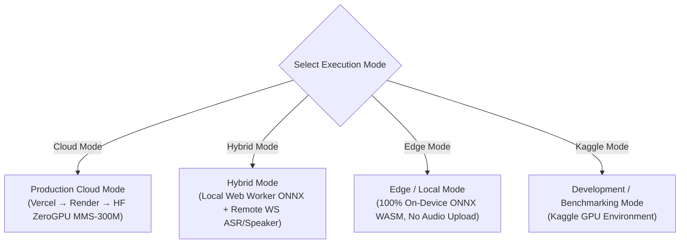
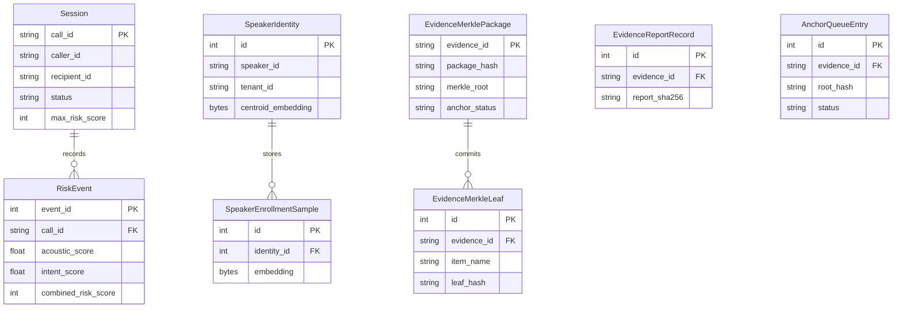
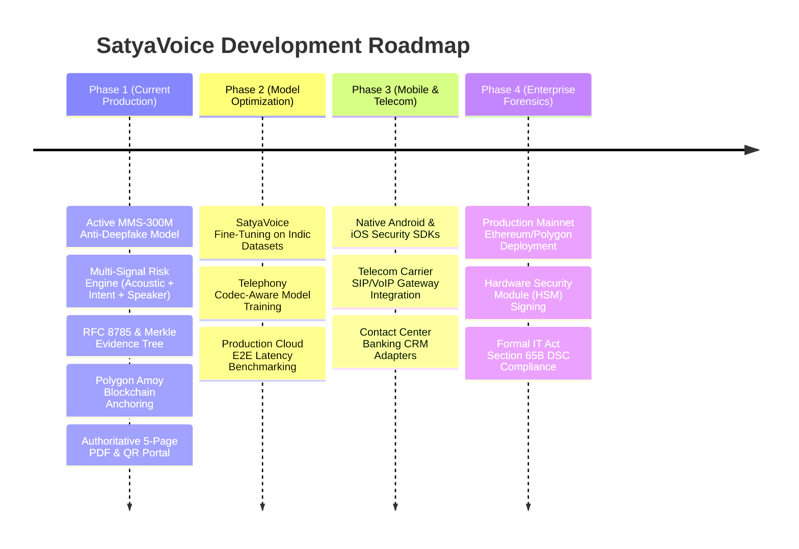

<div align="center">



<br />

# SATYAVOICE

### Real-Time Voice Deepfake &amp; Call-Fraud Detection with Cryptographically Verifiable Forensics

[](https://github.com/Devanshshar01/sih-voice)
[](https://github.com/Devanshshar01/sih-voice)
[](https://fastapi.tiangolo.com/)
[](https://reactjs.org/)
[-8247e5.svg?style=for-the-badge&logo=polygon)](https://amoy.polygonscan.com/)
[](https://huggingface.co/spaces/devanshshar01/satyavoice-gpu)
[](LICENSE)

<br />

[🌐 **Live Production App**](https://sih-voice.vercel.app) &nbsp;•&nbsp;
[⚙️ **Backend API (Swagger)**](https://satyavoice-api.onrender.com/docs) &nbsp;•&nbsp;
[🤗 **ZeroGPU Inference Space**](https://devanshshar01-satyavoice-gpu.hf.space) &nbsp;•&nbsp;
[📜 **Smart Contract (Amoy)**](https://amoy.polygonscan.com/address/0xcB5E4E1A318cE5dcaa2B483d020E42f7343cb987) &nbsp;•&nbsp;
[📦 **GitHub Repository**](https://github.com/Devanshshar01/sih-voice)

<br />

---

### Project Identity &amp; SIH Submission

| Attribute | Specification |
|:---|:---|
| **Problem Statement** | **SIH 2026 — PS 26104** (*AI-Powered Real-Time Detection &amp; Prevention of Voice Cloning Impersonation Attacks*) |
| **Theme** | **Blockchain &amp; Cybersecurity** |
| **Category** | **Software** |
| **Team Name** | **PowerRangersX** |
| **Target Audience** | Banking contact centers, telecom operators, enterprise VoIP providers, cyber defense teams |

</div>

<br />

---

## 🧭 What is SatyaVoice?

**SatyaVoice** is an AI-powered real-time voice deepfake and call-fraud defense platform that combines acoustic anti-spoofing, speaker identity verification, speech context analysis, multi-signal risk fusion, and cryptographically verifiable forensic evidence with public blockchain anchoring.

Rather than acting merely as an isolated audio classification model, SatyaVoice provides a **complete defense-in-depth pipeline** designed for live telephony streams, mobile banking applications, and contact-center anti-impersonation workflows.

<br />

<table>
  <tr>
    <td width="33%" align="center" valign="top">
      <h3>🎙️ Acoustic AI Detection</h3>
      <p align="left">Evaluates live 16&nbsp;kHz audio streams against the <b>MMS-300M Anti-Deepfake</b> neural network on Hugging Face ZeroGPU to detect synthetic speech, neural voice clones, and voice conversion artifacts.</p>
    </td>
    <td width="33%" align="center" valign="top">
      <h3>🛡️ Fraud Context &amp; Identity</h3>
      <p align="left">Pairs <b>faster-whisper</b> multilingual transcription with real-time financial/urgency keyword heuristics and <b>ECAPA-TDNN</b> voiceprint vault matching to uncover social engineering attacks.</p>
    </td>
    <td width="33%" align="center" valign="top">
      <h3>⛓️ Merkle Proofs &amp; Blockchain</h3>
      <p align="left">Guarantees forensic integrity using <b>RFC&nbsp;8785 JCS canonicalization</b>, SHA-256 binary <b>Merkle trees</b>, automated <b>Polygon Amoy</b> root anchoring, and authoritative 5-page PDF reports with QR verification.</p>
    </td>
  </tr>
</table>

<br />

---

## ⚡ Core Capabilities

<table>
  <tr>
    <td width="50%" valign="top">
      <h4>🎯 Real-Time Voice Stream Ingestion</h4>
      <p>Continuous WebSocket audio streaming via Web Audio API AudioWorklet, utilizing 4.0-second sliding analysis windows with a 0.5-second hop cadence (decision update every 500 ms).</p>
      <sub><b>Tech:</b> WebSockets • AudioWorklet • 16 kHz Mono Float32 PCM</sub>
    </td>
    <td width="50%" valign="top">
      <h4>🧠 Neural Anti-Spoof Engine</h4>
      <p>Acoustic deepfake classification powered by the <code>nii-yamagishilab/mms-300m-anti-deepfake</code> SSL model deployed on Hugging Face ZeroGPU for low-latency scoring.</p>
      <sub><b>Tech:</b> MMS-300M SSL • fairseq • Hugging Face ZeroGPU</sub>
    </td>
  </tr>
  <tr>
    <td width="50%" valign="top">
      <h4>📝 Multilingual Speech Intent Analysis</h4>
      <p>Real-time speech-to-text transcription paired with intent pattern matching for high-risk transactional keywords (OTP, UPI, emergency funds, wire transfers).</p>
      <sub><b>Tech:</b> faster-whisper (small) • Multilingual Indic Hints</sub>
    </td>
    <td width="50%" valign="top">
      <h4>👤 Biometric Speaker Verification</h4>
      <p>Persistent voiceprint enrollment vault computing 192-dimensional embeddings to detect unauthorized caller voice swaps and impersonation during live calls.</p>
      <sub><b>Tech:</b> ECAPA-TDNN (SpeechBrain) • Cosine Distance Vault</sub>
    </td>
  </tr>
  <tr>
    <td width="50%" valign="top">
      <h4>⚖️ Multi-Signal Risk Fusion Engine</h4>
      <p>Convex combination scoring weighting Acoustic (0.60), Intent (0.30), and Identity Mismatch (0.10), triggering automated policy transitions (<code>ALLOW</code>, <code>WARN</code>, <code>LOCK_VERIFY</code>).</p>
      <sub><b>Tech:</b> Centralized Config • Transactional Hard Override</sub>
    </td>
    <td width="50%" valign="top">
      <h4>🔐 Cryptographic Merkle Forensics</h4>
      <p>Deterministic RFC 8785 JSON canonicalization generating SHA-256 artifact digests bound into a domain-separated binary Merkle tree with OpenZeppelin inclusion proofs.</p>
      <sub><b>Tech:</b> RFC 8785 JCS • SHA-256 • MerkleProof.sol</sub>
    </td>
  </tr>
  <tr>
    <td width="50%" valign="top">
      <h4>⛓️ Polygon Amoy Root Anchoring</h4>
      <p>Append-only smart contract anchoring evidence roots on the public Polygon Amoy testnet for immutable timestamping and independent third-party verification.</p>
      <sub><b>Tech:</b> Solidity ^0.8.20 • Web3.py • Polygon Amoy (80002)</sub>
    </td>
    <td width="50%" valign="top">
      <h4>📄 5-Page Forensic Report + QR Portal</h4>
      <p>Automated server-side ReportLab PDF generator compiling case identity, acoustic diagnostics, Merkle manifests, blockchain tx hashes, and dynamic QR verification codes.</p>
      <sub><b>Tech:</b> ReportLab • qrcode • External Byte Hashing</sub>
    </td>
  </tr>
</table>

<br />

---

## 🔄 How SatyaVoice Works

The diagram below illustrates the end-to-end telemetry flow from live microphone capture down to public blockchain verification:



<br />

---

## 🏛️ System Architecture

SatyaVoice enforces a clean separation of concerns, isolating browser clients, backend business logic, heavy GPU model serving, and decentralized blockchain verification:



<br />

---

## 🎙️ Real-Time Audio Ingestion Pipeline



### Ingestion Specifications & Adaptive Cadence

1. **Analysis Window & Hop:** 
   - **Sample Rate:** `16,000 Hz` (single channel mono).
   - **Window Duration:** `4.0 seconds` ($64,000\text{ samples}$).
   - **Hop Duration:** `0.5 seconds` ($8,000\text{ samples}$).
   - **Decision Cadence:** Every $500\text{ ms}$, a new sliding window is evaluated.
2. **Silero VAD Filtering:** Evaluates speech activity before model execution, preventing costly inference on silence or background noise.
3. **Decoupled Heavy Inference Cadence:**
   - Because full remote neural network inference on ZeroGPU takes several seconds of wall-clock time, **MMS is not invoked every 0.5 seconds**.
   - `VOICETRUST_ACOUSTIC_INTERVAL_SECONDS = 15.0`: Minimum spacing between remote inference starts.
   - `VOICETRUST_ACOUSTIC_MAX_STALE_SECONDS = 30.0`: Valid prior acoustic evidence is reused across $500\text{ ms}$ decision hops for up to $30\text{ seconds}$ before degrading safely.
   - **Single-Flight Lock:** Prevents overlapping concurrent remote requests from exhausting inference capacity.

<br />

---

## 🧠 AI / ML Stack & Model Attribution

| Pipeline Layer | Model Identifier / Library | Architecture | Operational Status |
|:---|:---|:---|:---|
| **Acoustic Anti-Spoof (Prod)** | `nii-yamagishilab/mms-300m-anti-deepfake` | MMS-300M SSL + FC Head | **Active Cloud Production (ZeroGPU)** |
| **Acoustic Anti-Spoof (Legacy)** | `facebook/wav2vec2-xls-r-300m` | XLS-R 300M SSL | Historical Baseline (Deprecated) |
| **Optional Edge Anti-Spoof** | Local Browser ONNX Model | WebAssembly ONNX Model | Active Edge (Browser Worker Only) |
| **ASR & Intent Analysis** | `faster-whisper` (`small`) | Transformer Encoder-Decoder | Active Cloud & Local Backend |
| **Speaker Verification** | `speechbrain/spkrec-ecapa-voxceleb` | ECAPA-TDNN (192-dim) | Active Cloud & Local Backend |
| **Voice Activity Detection** | `silero-vad` (v6.2+) | PyTorch Deep VAD Filter | Active Pipeline Preprocessor |

> [!IMPORTANT]
> **Model Attribution & Transparency Notice:**  
> - The production acoustic deepfake model is `nii-yamagishilab/mms-300m-anti-deepfake`, created by **NII / Yamagishi Lab (National Institute of Informatics, Japan)** and distributed under the **CC BY-NC-SA 4.0** license for research and educational purposes.
> - SatyaVoice runs this checkpoint **off-the-shelf**. SatyaVoice has **not fine-tuned, re-trained, or created** this checkpoint, and has **not** verified formal Indian-language deepfake benchmarks. SatyaVoice-specific fine-tuning on Indic speech corpora is planned for future phases.

### Anti-Spoofing Score Semantics
- **Raw Output:** Softmax probabilities `[fake_probability, real_probability]`.
- **Score Mapping:** SatyaVoice directly maps `fake_probability` $\rightarrow$ `acoustic_score`. A higher score denotes **higher synthetic/fake risk**.
- **Failure Degradation:** If the remote GPU endpoint times out or errors, the score degrades to a neutral `0.50` with an explicit `degraded: {"anti_spoof": "unavailable"}` warning flag. It is **never silently classified as genuine**.

<br />

---

## ⚖️ Multi-Signal Risk Fusion Engine



### Risk Equation & Weights

$$R_{\text{total}} = 100 \times \left( W_a \cdot A + W_i \cdot I + W_m \cdot M \right)$$

- **$A$ (Acoustic Score):** $A \in [0, 1]$, synthetic speech probability from MMS-300M. ($W_a = 0.60$)
- **$I$ (Intent Score):** $I \in [0, 1]$, keyword urgency/financial score from faster-whisper transcripts. ($W_i = 0.30$)
- **$M$ (Identity Mismatch):** $M = \max(0, 1 - \text{speaker\_similarity})$. If an enrolled voiceprint exists, low similarity increases identity risk. When the speaker is UNKNOWN, $M = 0$ (neutral). ($W_m = 0.10$)
- **Transactional Hard Override:** High-risk financial categories (`otp`, `upi`, `bank transfer`) combined with signal ambiguity $\ge 0.10$ immediately force $R_{\text{total}} = 100$ (`LOCK_VERIFY`).

<br />

---

## 📜 Cryptographic Forensics & Merkle Pipeline

SatyaVoice generates a deterministic, tamper-evident evidence package for every monitored call:



### Cryptographic Principles Applied

1. **RFC 8785 JSON Canonicalization Scheme (JCS):** Resolves JSON serialization ambiguity across Python, TypeScript, and Solidity by enforcing strict UTF-16 code-unit key ordering and standardized floating-point representation.
2. **Domain-Separated Merkle Tree (`app/core/merkle.py`):**
   - **Leaf Hash:** $\text{leaf} = \text{SHA-256}(0x00 \mathbin{\Vert} \text{data})$
   - **Branch Hash:** $\text{node} = \text{SHA-256}(0x01 \mathbin{\Vert} \min(a,b) \mathbin{\Vert} \max(a,b))$
   - **Deterministic Sorting:** Leaves are sorted by digest prior to construction, ensuring insertion-order independence.
   - **OpenZeppelin Compatibility:** Proofs are formatted as sorted-pair sibling arrays matching OpenZeppelin's audited `MerkleProof.sol`.
3. **External PDF Byte Hashing:** The ReportLab PDF is rendered, hashed externally (`evidence_report_records.report_sha256`), and exposed via the `X-Report-SHA256` HTTP header, preventing circular self-referential hashing.

<br />

---

## ⛓️ Blockchain Anchoring (Polygon Amoy Testnet)



### Blockchain Technical Specifications

- **Network:** Polygon Amoy Testnet (Chain ID: `80002`)
- **Smart Contract Address:** [`0xcB5E4E1A318cE5dcaa2B483d020E42f7343cb987`](https://amoy.polygonscan.com/address/0xcB5E4E1A318cE5dcaa2B483d020E42f7343cb987)
- **Primary Function:** `anchorEvidence(bytes32 evidenceRoot, bytes32 evidenceId)`
- **Access Control:** `onlyOwner` modifier ensures only the authenticated backend submitter wallet can commit roots.
- **Privacy & Security Guarantee:** **Zero raw audio, zero transcripts, and zero PII are placed on-chain.** Only 32-byte cryptographic digests are committed.
- **Validated Testnet Transaction Example:**
  - **Transaction Hash:** [`0xa70ba2018e96d96546edb2e554fee2e718cf8ffb66f7f1e530ba4afb2f2e49b9`](https://amoy.polygonscan.com/tx/0xa70ba2018e96d96546edb2e554fee2e718cf8ffb66f7f1e530ba4afb2f2e49b9)
  - **Block Number:** `48366666`

<br />

---

## 🔍 Independent Verification & Authoritative Forensic Report

### Automated 8-Step Verification Routine

Verifiers query `POST /api/v1/forensics/merkle/{evidence_id}/verify` or scan the embedded QR code:

1. **Retrieve Manifest:** Load stored RFC 8785 canonical manifest.
2. **Recompute JCS Bytes:** Re-serialize JSON using RFC 8785 rules.
3. **Verify Package Digest:** Confirm `sha256(jcs_bytes) == package_hash`.
4. **Validate Leaves:** Recompute domain-separated leaf hashes $\text{SHA-256}(0x00 \mathbin{\Vert} \text{raw})$.
5. **Rebuild Merkle Tree:** Reconstruct root hash using sorted-pair branch hashing.
6. **Verify Inclusion Proofs:** Validate item-level Merkle inclusion proofs.
7. **Query Blockchain RPC:** Check root presence in `AnchorRoot.sol` on Polygon Amoy.
8. **Return Status:** Produce verified state (`VERIFIED`, `PENDING`, `FAILED`, `UNAVAILABLE`).

### 5-Page Backend Forensic PDF Structure

```
┌─────────────────────────┐  ┌─────────────────────────┐  ┌─────────────────────────┐
│ PAGE 1: Case Identity   │  │ PAGE 2: AI Diagnostics  │  │ PAGE 3: Merkle Manifest │
│ • Session & Call IDs    │  │ • 16 kHz Codec Info     │  │ • RFC 8785 JSON Package │
│ • Timestamps & Duration │  │ • MMS-300M Spoof Scores │  │ • SHA-256 Leaf Digests  │
│ • Case Metadata Summary │  │ • ASR Intent & Speaker  │  │ • Inclusion Proof Hashes│
└─────────────────────────┘  └─────────────────────────┘  └─────────────────────────┘
              ┌─────────────────────────┐  ┌─────────────────────────┐
              │ PAGE 4: Blockchain Data │  │ PAGE 5: QR & Portal     │
              │ • Polygon Amoy Tx Hash  │  │ • Dynamic Verification QR│
              │ • Block Number (80002)  │  │ • Public Verification URL│
              │ • Contract Address      │  │ • Integrity Disclaimers │
              └─────────────────────────┘  └─────────────────────────┘
```

> [!NOTE]
> **Forensic Legal Status:**  
> The forensic PDF is a cryptographically verifiable, tamper-evident audit artifact. It does **not** constitute formal court-certified evidence under Section 65B of the Indian Evidence Act unless signed via a qualified digital signature (DSC) infrastructure.

<br />

---

## 💻 Product Preview & User Interface

The React 18 TypeScript frontend delivers live audio visualizations, risk gauges, and forensic verification tools:

<table>
  <tr>
    <td width="50%" align="center">
      <b>Live Call Security Dashboard</b><br />
      <sub>Real-time waveform, trust gauge, risk timeline, and policy indicators</sub><br /><br />
      <!-- TODO: Add production dashboard screenshot -->
      <code>[ Live Audio Spectrum • Trust Gauge • Telemetry Stream ]</code>
    </td>
    <td width="50%" align="center">
      <b>Forensic Evidence &amp; Merkle Explorer</b><br />
      <sub>RFC 8785 manifest viewer, leaf hashes, and Polygon Amoy tx links</sub><br /><br />
      <!-- TODO: Add production forensics view screenshot -->
      <code>[ Merkle Tree Viewer • SHA-256 Hashes • On-Chain Root ]</code>
    </td>
  </tr>
  <tr>
    <td width="50%" align="center">
      <b>Threat Breakdown &amp; Intent Analysis</b><br />
      <sub>Acoustic spoof probabilities, ASR keywords, and speaker voiceprint delta</sub><br /><br />
      <!-- TODO: Add production threat breakdown screenshot -->
      <code>[ Acoustic Score: 0.74 • Intent: OTP/UPI • ID Delta: 0.05 ]</code>
    </td>
    <td width="50%" align="center">
      <b>Step-Up Challenge &amp; Out-of-Band Auth</b><br />
      <sub>Simulated TOTP out-of-band verification modal for locked sessions</sub><br /><br />
      <!-- TODO: Add production verification modal screenshot -->
      <code>[ 6-Digit TOTP Challenge • Policy State: LOCK_VERIFY ]</code>
    </td>
  </tr>
</table>

<br />

---

## 🌐 Operating Modes: Cloud, Hybrid, Edge & Kaggle



| Operating Mode | Audio Ingestion | Detection Engine | Network Telemetry | Primary Benefit |
|:---|:---|:---|:---|:---|
| **Cloud (Production)** | Streamed via WSS | Remote MMS-300M (ZeroGPU) | WebSocket Telemetry | Full multi-signal classification |
| **Hybrid** | Local + Streamed | Web Worker ONNX + Remote ASR | WSS + Web Worker | Low-latency local anti-spoof + server context |
| **Edge / Local** | **Kept Local (Strict)**| Browser ONNX Runtime Web (WASM) | REST `/call/start` only | **100% Data Privacy (Zero Audio Upload)** |
| **Kaggle** | Local WAV Files | Offline GPU Python Scripts | None | Latency profiling & model development |

> **Edge Mode Privacy Guarantee (`src/hooks/useCallSession.ts`):**  
> When operating in **Edge/Local Mode**, `forbidsRawAudioUpload` strictly disables WebSocket streaming. Raw audio PCM frames never leave the user's browser memory.

<br />

---

## 📡 Full API Reference

| Category | Method | Endpoint | Description |
|:---|:---|:---|:---|
| **System** | `GET` | `/health` | Basic service health check |
| **System** | `GET` | `/ready` | Deep readiness check (Detector, Database, Redis status) |
| **Call Lifecycle** | `POST` | `/api/v1/call/start` | Initialize monitored session; returns `call_id` &amp; WS URL |
| **Call Lifecycle** | `GET` | `/api/v1/call/{call_id}/risk` | Query current risk score and complete chronological timeline |
| **Call Lifecycle** | `POST` | `/api/v1/call/action` | Attempt sensitive action (Returns HTTP 403 when locked) |
| **Call Lifecycle** | `POST` | `/api/v1/call/{call_id}/terminate` | Terminate session, flush audit logs, and finalize evidence |
| **Streaming** | `WS` | `/api/v1/call/{call_id}/stream` | Real-time WebSocket audio streaming &amp; bidirectional telemetry |
| **Batch Analysis** | `POST` | `/api/v1/audio/analyze` | Single WAV file batch classification (Judge/QA testing) |
| **Speaker Vault** | `POST` | `/api/v1/speaker/enroll` | Enroll new speaker voiceprint embedding (ECAPA-TDNN) |
| **Speaker Vault** | `POST` | `/api/v1/speaker/verify` | Verify audio sample against enrolled identity profile |
| **Speaker Vault** | `GET` | `/api/v1/speaker/identities` | List active enrolled identities |
| **Step-Up Verification** | `POST` | `/api/v1/verification/request` | Issue time-limited TOTP challenge for locked calls |
| **Step-Up Verification** | `POST` | `/api/v1/verification/challenge` | Submit TOTP response code to unlock session |
| **Forensics** | `POST` | `/api/v1/forensics/merkle/register` | Register new Merkle evidence package |
| **Forensics** | `POST` | `/api/v1/forensics/merkle/{id}/verify` | Cryptographically verify Merkle evidence package |
| **Forensics** | `GET` | `/api/v1/forensics/merkle/{id}/report.pdf` | Download authoritative 5-page forensic PDF |
| **Forensics** | `GET` | `/api/v1/forensics/merkle/packages` | List all registered Merkle packages |

<br />

---

## 🗄️ Database Schema & Persistence Layer

The persistence layer is implemented via **SQLAlchemy ORM** (`app/db/models.py`) with full migration support via Alembic:



<br />

---

## 🔒 Security & Privacy Model

- **Privacy-by-Design:** Raw audio is **never persisted to disk** in the audit database. Only mathematical derived features (scores, timestamps, embeddings) are saved.
- **Zero PII on Blockchain:** Only 32-byte cryptographic hashes (`evidenceRoot`, `evidenceId`) are anchored to Polygon Amoy.
- **Owner-Gated Smart Contract:** `AnchorRoot.sol` uses the `onlyOwner` modifier, rejecting unauthorized transactions.
- **Evidence Idempotency:**
  - Same `evidence_id` + same `package_hash` $\rightarrow$ Safe duplicate / idempotent response.
  - Same `evidence_id` + different `package_hash` $\rightarrow$ Rejected as a hash conflict.
- **CORS Protection:** Configurable via `VOICETRUST_CORS_ORIGINS` to prevent cross-origin abuse.

<br />

---

## 🛠️ Technology Stack

```
Frontend:          React 18 • TypeScript • Vite • Tailwind CSS • Recharts • Lucide Icons • ONNX Runtime Web
Backend Server:    Python 3.10+ • FastAPI • Uvicorn • WebSockets • SQLAlchemy • Alembic • Pydantic v2
AI / ML Models:    MMS-300M Anti-Deepfake • faster-whisper • ECAPA-TDNN (SpeechBrain) • Silero VAD • PyTorch
Forensics:         RFC 8785 JCS • SHA-256 • ReportLab (PDF) • qrcode • Web3.py
Blockchain:        Solidity ^0.8.20 • OpenZeppelin Contracts • Polygon Amoy Testnet (Chain ID 80002)
Cloud Infrastructure: Vercel (Frontend) • Render (Backend API) • Hugging Face ZeroGPU (ML Space)
```

<br />

---

## 📂 Repository Structure

```
sih-voice/
├── app/                        # FastAPI Backend Application
│   ├── api/v1/                 # REST & WebSocket Route Endpoints
│   │   ├── analyze.py          # Single-file batch analysis endpoint
│   │   ├── call.py             # Call lifecycle & policy endpoints
│   │   ├── forensics.py        # Merkle evidence & PDF report endpoints
│   │   ├── speaker.py          # ECAPA speaker vault endpoints
│   │   ├── stream.py           # WebSocket live streaming ingestion
│   │   └── verification.py    # Out-of-band TOTP step-up endpoints
│   ├── config.py               # Central configuration, weights & thresholds
│   ├── core/                   # Core algorithms & mathematical logic
│   │   ├── jcs.py              # RFC 8785 JSON Canonicalization Scheme
│   │   ├── merkle.py           # Binary Merkle tree & inclusion proof generator
│   │   ├── risk_engine.py      # Multi-signal risk fusion engine
│   │   └── session_manager.py  # In-memory session & ring buffer manager
│   ├── db/                     # Database schemas & migrations
│   │   ├── database.py         # SQLAlchemy engine setup
│   │   └── models.py           # ORM database schemas
│   ├── services/               # Model providers & infrastructure services
│   │   ├── anchor_adapter.py   # Polygon Web3 blockchain anchoring adapter
│   │   ├── forensic_pdf.py     # ReportLab 5-page forensic PDF generator
│   │   ├── ml_detector.py      # Acoustic anti-spoof model wrappers
│   │   ├── speaker_vault.py    # ECAPA speaker enrollment & matching
│   │   ├── vad.py              # Silero VAD filtering service
│   │   └── zerogpu_provider.py # Hugging Face ZeroGPU client provider
│   └── main.py                 # FastAPI entrypoint, CORS & lifespan hooks
├── contracts/                  # Solidity Smart Contracts
│   ├── AnchorRoot.sol          # Evidence root anchoring contract (v1.1.0)
│   └── MerkleProof.sol         # OpenZeppelin Merkle proof verifier
├── hf_zero_gpu/                # Hugging Face ZeroGPU Serving Code
│   └── app.py                  # Gradio inference server for MMS-300M
├── src/                        # React 18 TypeScript Frontend
│   ├── components/             # UI Components (CallDashboard, ForensicsView, etc.)
│   ├── hooks/                  # Custom React Hooks (useCallSession)
│   ├── lib/                    # API & Local Inference Client Libraries
│   └── App.tsx                 # Main React Application Container
├── public/                     # Static Web Assets & Workers
│   └── onnx-worker.js          # Web Worker for Local ONNX Inference
├── tests/                      # Pytest & Vitest Automated Suites
├── scripts/                    # Utility, benchmark, and demo scripts
├── Dockerfile                  # Container build specification
├── requirements.txt            # Python backend dependencies
└── package.json                # Node.js frontend dependencies
```

<br />

---

## ⚡ Performance & Latency Facts

To maintain strict scientific accuracy, SatyaVoice clearly delineates verified compute latencies from production cloud network times:

- **Sliding Decision Cadence:** The ingestion engine buffers 4.0 seconds of audio and evaluates a decision frame every **0.5 seconds (500 ms)**.
- **Verified In-Process Backend Overhead:** Internal server compute overhead (Codec normalization + Silero VAD + Risk Fusion + WebSocket serialization) is measured at **~56 ms to 63 ms** (p95).
- **Remote ZeroGPU Inference:** Warm remote inference runs on Hugging Face ZeroGPU take tens to hundreds of milliseconds. Cold starts require multi-second initialization.
- **Latency Claim Boundary:** Sub-500 ms is an **architectural decision-window target**, not a formally benchmarked production cloud end-to-end latency claim.

<br />

---

## 📊 Comprehensive Implementation Status

| Capability / Module | Implementation Status | Technical Notes |
|:---|:---|:---|
| **Live WebSocket Voice Ingestion** | ✅ Implemented | 16 kHz Mono Float32 PCM streaming |
| **Codec Normalization** | ✅ Implemented | Native PCM / G.711 μ-law/A-law; Opus/AMR capability-gated |
| **Sliding Audio Windowing** | ✅ Implemented | 4.0s window / 0.5s hop (500 ms decision cadence) |
| **Silero VAD Filtering** | ✅ Implemented | Speech coverage gating prior to inference |
| **Remote Acoustic Anti-Spoof** | ✅ Production | `nii-yamagishilab/mms-300m-anti-deepfake` via ZeroGPU |
| **ASR & Intent Analysis** | ✅ Implemented | faster-whisper `small` + financial keyword scoring |
| **Speaker Verification** | ✅ Implemented | ECAPA-TDNN voiceprint embedding & vault matching |
| **Multi-Signal Risk Fusion** | ✅ Implemented | Fused formula ($W_a=0.60, W_i=0.30, W_m=0.10$) |
| **Transactional Hard Override** | ✅ Implemented | OTP/UPI keyword detection forces score = 100 |
| **Policy State Router** | ✅ Implemented | Enforces `ALLOW`, `WARN`, `LOCK_VERIFY` |
| **Browser ONNX Edge Mode** | ✅ Implemented | WebAssembly local inference (`forbidsRawAudioUpload`) |
| **JCS Canonicalization** | ✅ Implemented | RFC 8785 compliant key sorting & float formatting |
| **SHA-256 Digest Ledger** | ✅ Implemented | Multi-level hashing of all forensic artifacts |
| **Binary Merkle Tree** | ✅ Implemented | Domain-separated (`0x00`/`0x01`), sorted-leaf Merkle tree |
| **Polygon Amoy Anchoring** | ✅ Implemented & Validated | Contract `0xcB5E4E...` on Chain ID `80002` |
| **Authoritative 5-Page PDF** | ✅ Implemented | ReportLab backend generation with QR verification |
| **Verification REST API** | ✅ Implemented | Full 8-step cryptographic & blockchain verification |
| **Native Android Mobile SDK** | ❌ Future Scope | Planned post-SIH development |
| **SatyaVoice MMS Fine-Tuning** | ❌ Future Scope | Planned model customization on Indic speech datasets |
| **Formally Verified E2E Latency** | ❌ Architectural Target | Internal compute ~56-63ms verified; cloud E2E pending |

<br />

---

## 🗺️ Current Scope vs. Future Roadmap



### Current Scope (Implemented Today)
- Real-time streaming voice analysis via WebSockets.
- Active cloud anti-spoof classification using MMS-300M Anti-Deepfake.
- Multi-signal risk fusion combining acoustic, intent, and speaker identity mismatch.
- Privacy-preserving audit trail (metadata only, zero raw audio saved).
- Cryptographically verifiable Merkle evidence packages & Polygon Amoy testnet anchoring.
- 5-page backend-generated forensic PDF report with QR code verification.

### Future Scope (Planned Enhancements)
- Fine-tuning MMS-300M on IndicSynth and regional Indian voice datasets.
- Native Android/iOS SDK for direct integration into banking mobile apps.
- Telecom carrier SIP proxy module for network-level call fraud blocking.
- Production mainnet blockchain deployment with hardware security module (HSM) digital signatures.

<br />

---

## ⚖️ Current Limitations & Honest Engineering Notes

1. **End-to-End Latency Verification:** While internal backend compute overhead is verified at **~56–63 ms**, production end-to-end cloud latency remains subject to variable remote GPU network round-trip times.
2. **Model Training:** SatyaVoice currently uses the pretrained MMS-300M Anti-Deepfake checkpoint off-the-shelf; fine-tuning on Indic telephony audio is planned for subsequent phases.
3. **Testnet Blockchain Deployment:** Anchoring is currently operating on the public **Polygon Amoy Testnet** (Chain ID: `80002`), not on mainnet.
4. **Legal Admissibility:** The generated forensic PDF is a tamper-evident cryptographic artifact; formal court admissibility under Indian Evidence Act Section 65B requires an enterprise DSC infrastructure.

<br />

---

## 🚀 Local Development & Setup Guide

### Prerequisites
- Python 3.10+
- Node.js 18+ and pnpm / npm
- Git

### 1. Backend Setup

```bash
# Clone the repository
git clone https://github.com/Devanshshar01/sih-voice.git
cd sih-voice

# Create and activate Python virtual environment
python -m venv .venv
# On Windows:
.venv\Scripts\activate
# On Linux/macOS:
source .venv/bin/activate

# Install dependencies
pip install -r requirements.txt

# Copy environment configuration
cp .env.example .env

# Launch local FastAPI backend server
uvicorn app.main:app --reload --port 8000
```
- API Server: `http://localhost:8000`
- Swagger Documentation: `http://localhost:8000/docs`

### 2. Frontend Setup

```bash
# In the repository root:
npm install

# Start Vite local development server
npm run dev
```
- Frontend UI: `http://localhost:5173`

### 3. Automated Testing

```bash
# Run backend pytest suite
python -m pytest -q

# Run frontend typecheck & vitest suite
npm run typecheck
npm run test
```

<br />

---

## ⚙️ Environment Variables Reference

Key configuration parameters defined in `.env.example` / `app/config.py`:

```env
# Server & Environment
ENVIRONMENT=development
VOICETRUST_CORS_ORIGINS=http://localhost:5173,https://sih-voice.vercel.app

# ML Detector Selection
VOICETRUST_DETECTOR_MODE=zerogpu
HF_ZERO_GPU_SPACE=https://huggingface.co/spaces/devanshshar01/satyavoice-gpu
VOICETRUST_MODEL_ID=nii-yamagishilab/mms-300m-anti-deepfake

# Risk Fusion Weights & Thresholds
VOICETRUST_ACOUSTIC_WEIGHT=0.60
VOICETRUST_INTENT_WEIGHT=0.30
VOICETRUST_IDENTITY_WEIGHT=0.10
VOICETRUST_WARN_THRESHOLD=40
VOICETRUST_LOCK_THRESHOLD=70

# Blockchain Anchoring (Polygon Amoy)
VOICETRUST_BLOCKCHAIN_MODE=LIVE
VOICETRUST_BLOCKCHAIN_NETWORK=polygon-amoy
VOICETRUST_BLOCKCHAIN_CHAIN_ID=80002
VOICETRUST_BLOCKCHAIN_RPC_URL=https://rpc-amoy.polygon.technology
VOICETRUST_BLOCKCHAIN_CONTRACT_ADDRESS=0x....
VOICETRUST_BLOCKCHAIN_PRIVATE_KEY=your_private_key_here
```

<br />

---

## 📚 Research & References

- **MMS Anti-Deepfake Model:** `nii-yamagishilab/mms-300m-anti-deepfake` (NII / Yamagishi Lab, CC BY-NC-SA 4.0) — [Hugging Face Model Card](https://huggingface.co/nii-yamagishilab/mms-300m-anti-deepfake)
- **JSON Canonicalization Scheme:** RFC 8785 JCS — [RFC 8785 Specification](https://www.rfc-editor.org/rfc/rfc8785)
- **Automatic Speech Recognition:** `faster-whisper` (SYSTRAN) — [GitHub Repository](https://github.com/SYSTRAN/faster-whisper)
- **Speaker Embedding:** `speechbrain/spkrec-ecapa-voxceleb` (SpeechBrain) — [Hugging Face Model Card](https://huggingface.co/speechbrain/spkrec-ecapa-voxceleb)
- **Voice Activity Detection:** `silero-vad` — [GitHub Repository](https://github.com/snakers4/silero-vad)
- **Smart Contract Verification:** OpenZeppelin Contracts v5.0 — [OpenZeppelin Docs](https://docs.openzeppelin.com/)

<br />

---

## ⚖️ License

- **Codebase & Contracts:** Distributed under the [MIT License](LICENSE).
- **Model Checkpoints:** `nii-yamagishilab/mms-300m-anti-deepfake` is distributed under the **CC BY-NC-SA 4.0** license for non-commercial research and educational purposes.

<br />

---

<div align="center">

**SatyaVoice Development Team — PowerRangersX**  
*SIH 2026 — Smart India Hackathon*  
<sub>Building Cryptographic Trust in Every Voice Stream</sub>

</div>
